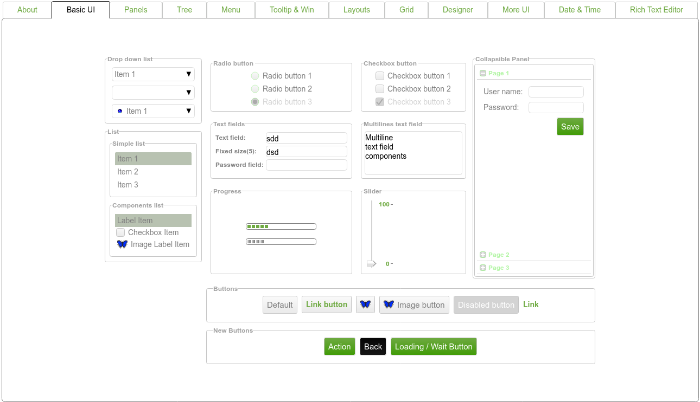

## Zebkit Theme Builder




Outputs a UI demo of most Zebkit UI components (and some bonus custom ones!). This is a simple method to be able to see all UI components in order to style them appropriately for your theme. Designed to work with the master repo located [here](https://github.com/barmalei/zebkit/).

Theme files are located at `/public/js/lib/rs/themes`. By default there is one custom theme called `bootstrap`, you can either customize this theme or make a new theme by creating another folder at the same location.
The name of the theme the builder and demo will use is defined in `config.js` at the root of the project.

The repo includes custom UI components and draw methods which are made available as part of the core zebkit.ui and zebkit.draw packages, if you wish to edit these, they are the `setup/ui-additions.js` and `setup/draw-additions.js` files repectively.

At startup, the project will fetch the current zebkit repo, patch the repo's gulpfile to include the custom components, and then output to `public/js/lib` two library files, `zebkit.js` and `zebkit.min.js` format. The minified file also contains all the theme files compressed and bundled using ZFS, the unminified file does not.


### Fetch Dependencies

Zebkit uses "gulp" as building tools, so we need it too. To install it type the following in a terminal:

```bash
  npm install gulp-cli -g
```


To install required nodejs packages run the following command from the repo's home folder: 
```bash
    npm install
```


### Run

To run the combined patcher and UI demo: 
```bash
    npm start
```

The process will fetch the master zebkit repo, patch it, compress and bundle it with your chosen theme, and make the resulting UI demo available at "http://localhost:3030".

If you run the project with a `NODE_ENV` environment variable set to `dev` (default) then the UI demo will use unminified zebkit.js with theme files located at `public/js/lib/rs/themes/<your theme>`. This means you can easily edit your theme files without having to re-run the project. If you wish to test the UI demo with the minified+bundled version then run with a `NODE_ENV` set to `prod`.

### To include in your project

Make sure you copy across the zebkit.min.js and then before you require zebkit assign the theme.

```bash
    zebkit.ui.config("theme", "<theme name>")
    zebkit.draw.configWithRs("themes/<theme name>}/draw.json")

    zebkit.require(
        function () {
            // your code...
        }
    );        
```

